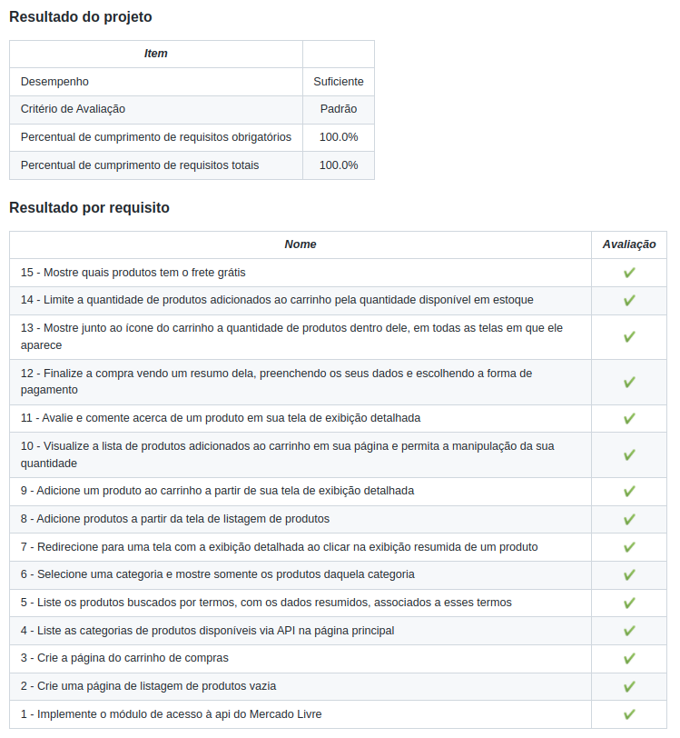

<h1>Sobre</h1>

Quarto projeto do módulo 2 - Front-end, da <a href="https://betrybe.com" target="_blank">Trybe!</a>

Nosso primeiro projeto em grupo! Contei com a ajuda de <a href="https://github.com/brunomourabastos" target="_blank">Bruno Monteiro</a>, <a href="https://github.com/tiago-jeronimo" target="_blank">Tiago Jerônimo</a> e <a href="https://github.com/BaianorASR" target="_blank">Adison Santos (Baianor)</a>

A proposta foi criar uma aplicação utilizando a API do Mercado Livre em que era possível navegar entre categorias de produtos, vê-los detalhadamente, adicionar ao carrinho, escolher modo de pagamento, realizar avaliação do produto etc.

<h1>Instalando</h1>

Para instalar, basta executar o comando <code>npm install</code> no diretório raiz do projeto.

Logo depois execute o comando <code>npm start</code>

<h1>Tecnologias utilizadas</h1>

<ul>
  <li>React</li>
  <li>React Router</li>
</ul>

<h1>Nota</h1>

